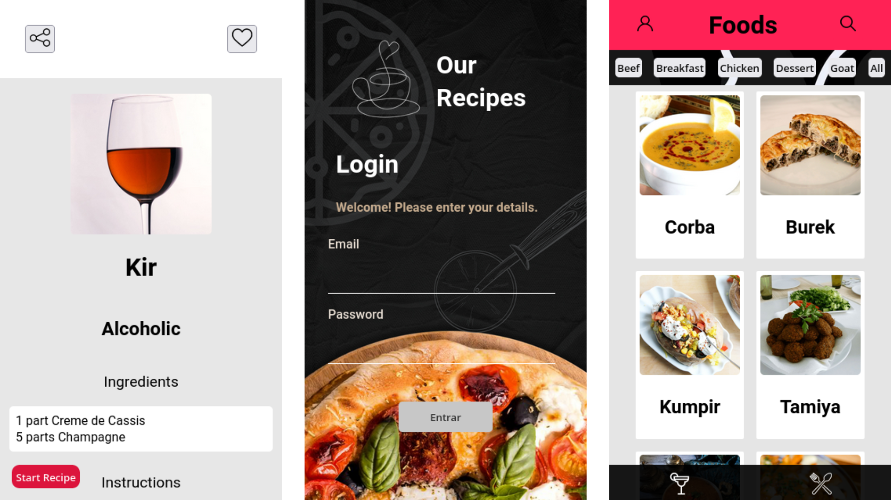

# Recipes App Project



> O projeto consiste em um aplicativo de receitas utilizando React, ContextApi e Hooks. Consumindo duas APIs simultâneamente.

## 💻 Pré-requisitos

Para usar, verifique os seguintes requisitos:

- Você instalou a versão mais recente de `NodeJs e NPM`

## 🚀 Instalando o Recipes App Project

Para instalar o projeto, clone o repositório e siga estas etapas:

Instalar dependências:

```
npm i
```

Iniciar projeto:

```
npm start
```

-- Ao iniciar o projeto, abra o modo inspecionar no navegador e defina a resolução para dispositivo móvel de (360px de largura por 640px altura).

## ☕ Usando Recipes App Project

Uma vez com a aplicação iniciada em seu navegador, basta digitar email e senha (não precisam ser dados reais) e quem sabe cozinhar alguma coisa!

## 📫 Contribuindo para o Trivia Project!

1. Clone este repositório.
2. Crie uma branch: `git checkout -b nome-da-branch`.
3. Faça suas alterações e confirme-as: `git commit -m 'mensagem-de-commit'`
4. Envie para o branch original: `git push origin nome-do-projeto / local`
5. Crie a solicitação de pull request.

Como alternativa, consulte a documentação do GitHub em [como criar uma solicitação pull](https://help.github.com/en/github/collaborating-with-issues-and-pull-requests/creating-a-pull-request).

## 🤝 Colaboradores

Agradecimento às seguintes pessoas que contribuíram para este projeto; foi um prazer codar com vocês!

<table>
  <tr>
    <td align="center">
      <a href="https://github.com/TomazDimas">
        <br>
        <sub>
          <b>Tomaz Dimas</b>
        </sub>
      </a>
    </td>
    <td align="center">
      <a href="https://github.com/LucasBelgamann">
        <br>
        <sub>
          <b>Lucas Belgamann</b>
        </sub>
      </a>
    </td>
    <td align="center">
      <a href="https://github.com/vhprestes">
        <br>
        <sub>
          <b>Victor Hugo</b>
        </sub>
      </a>
    </td>
    <td align="center">
      <a href="https://github.com/raulguilhermemartinslages">
        <br>
        <sub>
          <b>Raul Guilherme</b>
        </sub>
      </a>
    </td>
  </tr>
</table>

[⬆ Voltar ao topo](#recipes-app-project)<br>
